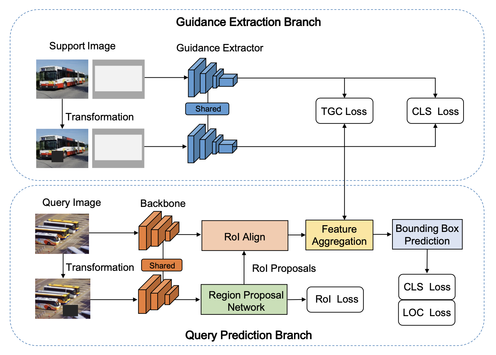

# 论文 Transformation Invariant Few-Shot Object Detection 复现

## 1.  TIP模型介绍

该论文提出 Transformation Invariant Principle（TIP），可以灵活地应用于各种元学习模型，以提高对新类目标的检测性能。

为了提高当前基于元学习的 FSOD 方法的泛化能力， TIP 方法在引导提取分支和查询预测分支上应用了一致性正则化。 对于引导提取分支，TIP模型在原始图像及其变换变体的引导向量上开发了TGC 损失函数，以在它们之间施加一致性。 对于查询预测分支，TIP首先预测变换图像的 RoI 建议来引入一致性正则化，然后根据这些 RoI 感兴趣区域的建议以及引导提取分支提取的变换不变引导向量，推测样本的边界框。



## 2. 数据集介绍

该论文利用**PASCAL VOC**和**MSCOCO**两个目标检测数据集对**TIP**模型的效果进行验证。

### 2.1 PASCAL  VOC

对于该数据集，VOC 07和VOC 12共有20个不同类别的16.5k train-val和5k test的图像组成。该论文使用VOC 07和VOC 12的train-val数据作为**训练集**，VOC 07的test数据作为**测试集**，将这20个类别划分为**15个base classes**和**5个novel classes**，总共使用三种不同的划分方法依次进行实验。

可以在官网上下载VOC 07和VOC 12的数据：

```
http://host.robots.ox.ac.uk/pascal/VOC
```

得到如下目录结构：

```
data/VOCdevkit
	VOC{2007,2012}/
		Annotations/
		ImageSets/
		JPEGImages/
		SegmentationClass/
		SegmentationObject/
```

将包含数据集分组信息的txt文件移动到对应路径：

```bash
mv VOCsplits/VOC2007/* VOCdevkit/VOC2007/ImageSets/Main
mv VOCsplits/VOC2012/* VOCdevkit/VOC2012/ImageSets/Main
```

### 2.2 MSCOCO

对于该数据集，COCO共有80个不同类别的80k train、40k validation和20k test图像组成。该论文使用COCO 2014 的5k minval图像作为**测试集**评估模型效果，剩下的35k train-val图像作为**训练集**，将这80个类别划分为**60个base classes**和**20个novel classes**，其中，20个novel classes与PASCAL VOC中的20个类别相同。

可以在官网上下载COCO 2014的数据：

```
images.cocodataset.org/zips
```

得到如下目录结构：

```
data/coco
	annotations/
	images/
		train2014/
		val2014/
```

## 3. PyTorch脚本到Mindspore脚本的转换

该模型的PyTorch版代码是基于[Few-shot Object Detection and Viewpoints Estimation for Objects in the wild](https://github.com/YoungXIAO13/FewShotDetection#installation)中的开源代码进行编写。

为高效率迁移模型及代码，此处使用鹏城实验室和华为联合开发的一款Mindspore生态适配工具——**MSadapter**。该工具能帮助用户高效使用昇腾算力，且在不改变**原有PyTorch用户**使用习惯的前提下，将代码快速迁移到Mindspore生态上。

MSAdapter的API完全参照PyTorch设计，用户仅需少量修改就能轻松地将PyTorch代码高效运行在昇腾上。目前MSAdapter已经适配**torch、torch.nn、torch.nn.function、torch.linalg**等800+接口；全面支持**torchvision**；并且在MSAdapterModelZoo中验证了70+主流PyTorch模型的迁移。


### 3.1 MSadapter安装

通过pip安装：

```python
pip install msadapter
```

通过源码安装：

```python
git clone https://git.openi.org.cn/OpenI/MSAdapter.git 
cd MSAdapter 
python setup.py install
```

### 3.2 MSadapter迁移指南

**Step1：替换导入模块（修改头文件）**

```python
# import torch
# import torch.nn as nn
# import torchvision import datasets, transforms

import msadapter.pytorch as torch
import msadapter.pytorch.nn as nn
import msadapter.torchvision import datasets, transforms
import mindspore as ms
```

**Step2：替换数据处理部分（修改头文件）**

```py
from msadapter.pytorch.utils.data import DataLoader
```

**Step3：替换网络训练脚本（修改代码写法）**

```py
# optimizer = torch.optim.SGD(net.parameters(), lr=0.01, momentum=0.9, weight_decay=0.0005)

optimizer = ms.nn.SGD(net.trainable_params(), learning_rate=0.01, momentum=0.9, weight_decay=0.0005)
```

更多迁移细节可参考：<https://openi.pcl.ac.cn/OpenI/MSAdapter>

## 4. 代码运行步骤

### 4.1 Base Training

在 Base Training 阶段，使用 **base classes** 的整个训练数据集训练模型：

**PASCAL VOC**

```bash
# the first spilt on VOC
bash run/train_voc_first.sh

# the second spilt on VOC
bash run/train_voc_second.sh

# the third spilt on VOC
bash run/train_voc_third.sh
```

**MSCOCO**

```bash
# COCO
bash run/train_coco.sh
```

最终得到预训练模型目录：

```
save_models/
	COCO/
	VOC_first/
	VOC_second/
	VOC_third/
```

### 4.2 Finetuing

在 Finetuning 阶段，在预训练模型的基础上，从 **novel classes** 中增加 **few-shot** 样本继续进行训练。

为了平衡 **base classes** 和 **novel classes** 的训练样本，从整个训练数据集中为每个 base class 随机选择 K 个标记实例，并将它们与样本较少的 novel classe 结合起来，形成一个新的 finetuning 数据集。

**PASCAL VOC**

```bash
# the first spilt on VOC
bash run/finetune_voc_first.sh

# the second spilt on VOC
bash run/finetune_voc_second.sh

# the third spilt on VOC
bash run/finetune_voc_third.sh
```

**MSCOCO**

```bash
# COCO
bash run/finetune_coco.sh
```

### 4.3 Testing

**PASCAL VOC**

VOC 07 的 test 数据集作为测试集来评估模型效果：

```bash
# the first split on VOC
bash run/test_voc_first.sh

# the second split on VOC
bash run/test_voc_second.sh

# the third split on VOC
bash run/test_voc_third.sh
```

**MSCOCO**

COCO 2014 的 minval 作为测试集来评估模型效果：

```bash
# coco
bash run/test_coco.sh
```

## 5. 实验结果

**标准FSOD**

**PASCAL VOC（AP@50）**

三种不同的数据划分方式，IoU的阈值设置为0.5，实验结果如下：


其中，Baseline为论文[Few-shot Object Detection and Viewpoints Estimation for Objects in the wild](https://github.com/YoungXIAO13/FewShotDetection#installation)中使用的模型，TIP为该论文的模型复现结果。

在PASCAL VOC数据集上Baseline实验结果可视化：


**COCO**

在 COCO 数据集的实验结果如下表所示：


其中，K代表Shots的个数。


​	

​			


